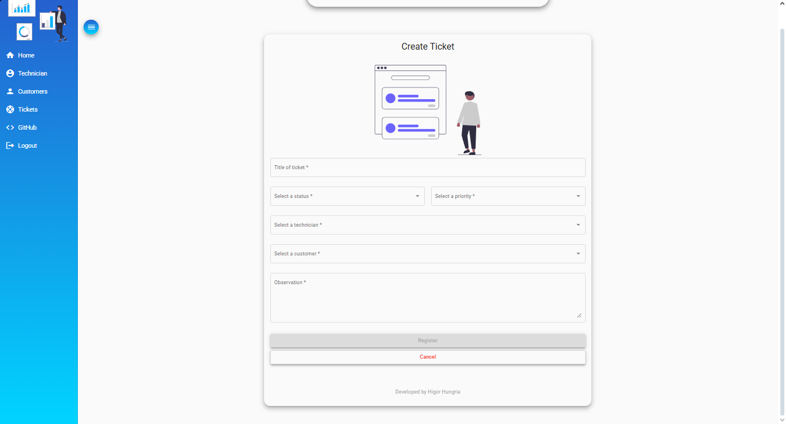
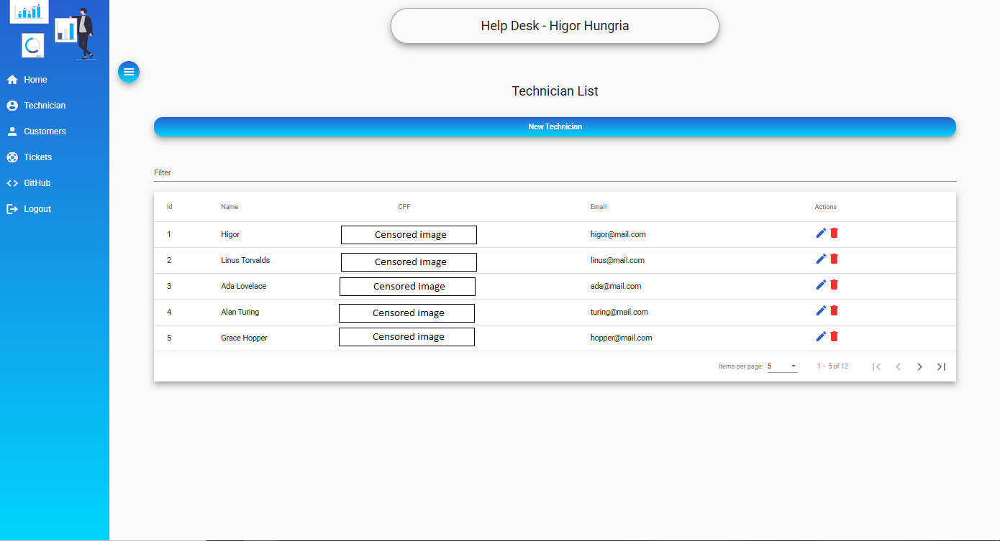

# Helpdesk Management System

A comprehensive helpdesk management system built with Angular 12, designed to streamline technical support operations. This application provides an intuitive interface for managing customers, technicians, and support tickets with secure authentication and a modern Material Design interface.

## Table of Contents

- [Features](#features)
- [Technologies Used](#technologies-used)
- [Installation](#installation)
- [Project Structure](#project-structure)
- [Screenshots](#screenshots)

# Features

- **Customer Management**: Complete CRUD operations for customer records
- **Technician Management**: Add, edit, and manage technical support staff
- **Ticket System**: Full ticket lifecycle management from creation to resolution
- **Secure Authentication**: JWT-based authentication and authorization
- **Responsive Design**: Mobile-friendly interface using Angular Material components
- **Input Validation**: Form masking and validation for data integrity
- **Toast Notifications**: Real-time user feedback with ngx-toastr
- **Modern UI**: Clean and intuitive Material Design interface

# Technologies Used

## Frontend Framework
- **Angular** (v12.0.3) - Core framework
  - @angular/animations
  - @angular/common
  - @angular/compiler
  - @angular/core
  - @angular/forms
  - @angular/platform-browser
  - @angular/platform-browser-dynamic
  - @angular/router

## UI Components
- **Angular Material** - Material Design components
- **Angular CDK** - Component Development Kit

## Libraries
- **@auth0/angular-jwt** - JWT authentication
- **ngx-mask** - Input masking
- **ngx-toastr** - Toast notifications
- **RxJS** - Reactive programming
- **TypeScript** - Type-safe JavaScript
- **Zone.js** - Angular change detection

## Development Tools
- **@angular/cli** - Angular CLI
- **@angular-devkit/build-angular** - Build tools
- **@angular/compiler-cli** - Template compiler
- **@types/node** - Node.js type definitions

# Installation

## Prerequisites

Ensure you have the following installed:
- **Node.js** (v12 or higher)
- **npm** (v6 or higher)
- **Angular CLI** (v12 or higher)

To install Angular CLI globally:
```bash
npm install -g @angular/cli@12
```
## Setup
### 1.Clone the repository:
```
git clone https://github.com/Higur1/front-helpdesk.git
cd front-helpdesk
```
### 2.Install dependencies:
```
npm install
```
### 3.Configure the environment:
Update API endpoint in
```
src/environments/environment.ts 
```
### 4.Start the development server:
```
ng serve
```
### 5.Open your browser and navigate to:
```
http://localhost:4200/
```
# Project Structure
```
front-helpdesk/
│
├── src/
│   ├── app/
│   │   ├── components/          # Application components
│   │   │   ├── customer/        # Customer management
│   │   │   ├── technician/      # Technician management
│   │   │   ├── ticket/          # Ticket management
│   │   │   ├── home/            # Home page
│   │   │   ├── login/           # Authentication
│   │   │   └── nav/             # Navigation
│   │   │
│   │   ├── services/            # Business logic and API calls
│   │   │   ├── auth.service.ts
│   │   │   ├── customer.service.ts
│   │   │   ├── technician.service.ts
│   │   │   └── ticket.service.ts
│   │   │
│   │   ├── models/              # TypeScript interfaces
│   │   ├── guards/              # Route guards
│   │   ├── interceptors/        # HTTP interceptors
│   │   ├── app-routing.module.ts
│   │   ├── app.component.ts
│   │   └── app.module.ts
│   │
│   ├── assets/                  # Static assets (images, icons)
│   ├── environments/            # Environment configurations
│   │   ├── environment.ts       # Development
│   │   └── environment.prod.ts  # Production
│   │
│   ├── index.html
│   ├── main.ts
│   └── styles.css               # Global styles
│
├── angular.json                 # Angular CLI configuration
├── package.json                 # Dependencies
├── tsconfig.json                # TypeScript configuration
└── README.md
```
## Key Directories
```
*components/: Contains all Angular components organized by feature
*services/: Handles HTTP requests and business logic
*models/: TypeScript interfaces for type safety
*guards/: Authentication and authorization guards
*interceptors/: HTTP interceptors for token injection
*environments/: Configuration for different deployment environments
```

# Screenshots

## Home Page
  

## Customer List
  

## New Ticket
  

## Ticket List
  

## Technician List


## New Technician


## Development By

[](https://github.com/higur1)

